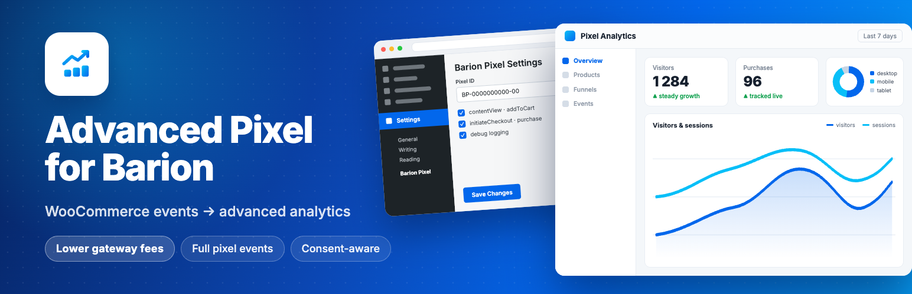

  

# Advanced Pixel for Barion

Barion Pixel integration for WooCommerce with full e-commerce event tracking, cookie consent support, and WP Consent API compatibility.

  <strong>English</strong> |
  <a href="docs/i18n/README.hu.md">Magyar</a> |
  <a href="docs/i18n/README.cs.md">Čeština</a> |
  <a href="docs/i18n/README.sk.md">Slovenčina</a> |
  <a href="docs/i18n/README.de.md">Deutsch</a> |
  <a href="docs/i18n/README.hr.md">Hrvatski</a> |
  <a href="docs/i18n/README.ro.md">Română</a> |
  <a href="docs/i18n/README.sl.md">Slovenščina</a> |
  <a href="docs/i18n/README.sr.md">Srpski</a>

## Features

- **Base Barion Pixel**: Loads the Barion tracking script site-wide (pageView fires automatically)
- **Full Event Tracking**: All mandatory e-commerce events per Barion documentation
  - `contentView`: Fired on product pages
  - `addToCart`: Fired when items are added to cart (client-side, works with page caching)
  - `initiateCheckout`: Fired when checkout begins
  - `purchase`: Fired on successful order completion (with duplicate prevention)
  - `setEncryptedEmail`: Sends billing email to Barion on purchase (encrypted by bp.js)
- **WP Consent API Integration**: Universal cookie consent support — works with CookieYes, Complianz, Real Cookie Banner, GDPR Cookie Compliance, Cookie Notice, and more
- **Cookie Law Info Fallback**: Direct integration for sites using CookieYes/Cookie Law Info
- **Admin Settings Panel**: Easy configuration through WordPress admin
- **Debug Mode**: Console logging for testing and development
- **bp.js Double-Load Detection**: Safely coexists with other plugins that load bp.js (e.g., Barion Payment Gateway)

## Installation

1. Upload the `advanced-pixel-for-barion` folder to `/wp-content/plugins/`
2. Activate the plugin through the 'Plugins' menu in WordPress
3. Navigate to Settings > Barion Pixel to configure

## Configuration

### Admin Settings

Access the settings page at **Settings > Barion Pixel** in WordPress admin.

#### Pixel ID (Required)
Enter your Barion Pixel ID (format: `BP-0000000000-00`). The Base Pixel will be loaded on all pages once this is set.

#### Enable Full Pixel Tracking
Toggle to enable/disable e-commerce event tracking. When disabled, only the Base Pixel loads (pageView for fraud prevention).

#### Debug Mode
Enable to log all Barion Pixel events to the browser console for testing.

## Documentation

Detailed documentation is available in the [`docs/`](docs/) folder:

- [Events Reference](docs/events-reference.md) — All tracked events, fields, and data types
- [Cookie Consent Integration](docs/cookie-consent.md) — WP Consent API, Cookie Law Info, and manual integration
- [Compatibility](docs/compatibility.md) — WooCommerce, Barion Payment Gateway, caching plugins
- [Testing Notes](docs/testing-notes.md) — bp.js quirks, debug mode, testing checklist

Documentation is also available in [Magyar](docs/i18n/hu/), [Čeština](docs/i18n/cs/), [Slovenčina](docs/i18n/sk/), [Deutsch](docs/i18n/de/), [Hrvatski](docs/i18n/hr/), [Română](docs/i18n/ro/), [Slovenščina](docs/i18n/sl/), and [Srpski](docs/i18n/sr/).

## Compatibility

- **WooCommerce**: Required for full event tracking (base pixel works without it)
- **Barion Payment Gateway** ([woocommerce-barion](https://github.com/szelpe/woocommerce-barion)): Coexists perfectly — that plugin handles payments, this one handles pixel tracking
- **Page caching**: Fully compatible (addToCart uses client-side JS)
- **Cookie plugins**: Any WP Consent API compatible plugin works automatically

## Requirements

- WordPress 5.0 or higher
- PHP 7.4 or higher
- WooCommerce 5.0+ (for full event tracking)
- Optional: [WP Consent API](https://wordpress.org/plugins/wp-consent-api/) for universal cookie consent support

## License

GPL-2.0-or-later — see [LICENSE](LICENSE) for details.

## Changelog

### 1.0.0
- Initial release
- Base Barion Pixel (pageView) implementation
- Full event tracking (contentView, addToCart, initiateCheckout, purchase, setEncryptedEmail)
- WP Consent API integration
- Cookie Law Info fallback integration
- Admin settings panel with debug mode
- Client-side addToCart (compatible with page caching)
- Variable product support
- Duplicate purchase prevention
- bp.js double-load detection
